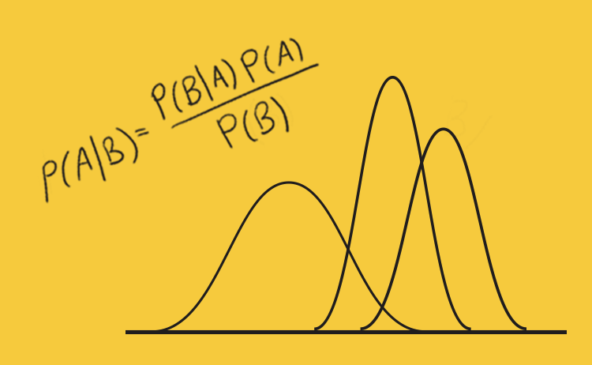

# **Overview**
Hi all, my name is Elijah and welcome to my Github repository.  
This repository contains my solutions to the first assignment for UBC STAT 545M taught by Dr. Vincenzo Coia.  

**Below I will demostrate using headers and indentations, pictures, and equations.**

## **Name:**
* Elijah Willie

## **Program**:
* Masters of science in **Bioinformatics**
* Supervisor
    + Sara Mostafavi

## **Background**:
* Bachelors of science in Computing Science and Biochemistry
* Minor in Statistics
* Supervisor(s)
    + Leonid Chindelevitch, Cedric Chauve
    

## **Interests**

 * Machine Learning
 
 * Statistical Learning
 
 * Bayesian Statistics
 





**Now that the introductions are over! Lets have some fun**

1. You can write code here: 

```{r}
summary(cars$dist)
summary(cars$speed)

```
2. You can insert tables:

X | Y
------------- | -------------
0  | 0
0  | 1
1  | 0
1  | 1

2. Links as well
* [Why not to trust statistics](https://mathwithbaddrawings.com/2016/07/13/why-not-to-trust-statistics/)
* [My exploration of the Gapminder data](https://github.com/STAT545-UBC-students/hw01-ecool50/blob/master/Stat545_A1.pdf)


