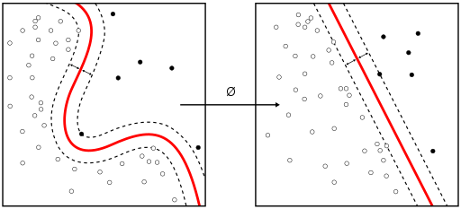

# **Overview**
Hi all, my name is Elijah and welcome to my Github repository.  
This repository contains my solutions to the first assignment for UBC STAT 545M taught by Dr. Vincenzo Coia.  

Below I will demostrate using headers and indentations, pictures, and equations.

## **Name:**
* Elijah Willie
* Here is a picture of me


## **Program**:
* Masters of science in **Bioinformatics**

## **Background**:
* Bachelors of science in Computing Science and Biochemistry
* Minor in Statistics

## **Interests**
* Machine Learning


* Quantum Mechanics

* Bayesian Statistics $$ P(A|B) = P(B|A)P(A)/{P(B) $$

* Statitistical Learning


* Video Games


* Soccer - Me playing soccer at UCLA


* My favorite soccer club is chelsea


# Now that the introductions are over! Lets have some fun
1. You can write code here: 

```{r}
summary(cars$dist)
summary(cars$speed)

```
2. You can insert tables:

X | Y
------------- | -------------
0  | 0
0  | 1
1  | 0
1  | 1

2. Links as well
* [Why not to trust statistics](https://mathwithbaddrawings.com/2016/07/13/why-not-to-trust-statistics/)
* [My exploration of the Gapminder data]()


